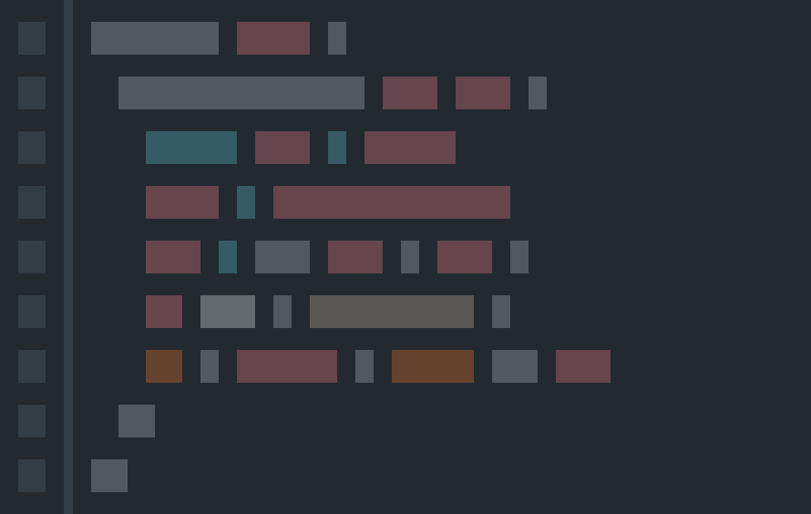

# Javascript Course 

Sometimes when stress and daily problems begin to affect income on the job, it is common for us to spend more time solving small problems that could be solved quickly if there was patience or time available. ⌚️⌚️ 

This repository serves to help in those cases, which with a quick view is already a push to solve routine code problems 💻💻 


## 📂 Conditionals

### ✅ Short-circuits conditionals
Short-circuit for execute a function just if a condition is true
```js
if(condition) {
  dosomething();
}

// it's the same as
(condition && dosomething());
```
If you have to set a default value to variables, you can simple do this:
```js
var a;
console.log(a); //undefined

a = a || 'default value';
console.log(a); //default value

a = a || 'new value';
console.log(a); //default value

function theSameOldFoo(name){ 
  name = name || 'beer' ;
  console.log("My best friend's name is " + name);
}

theSameOldFoo();  // My best friend's name is beer
theSameOldFoo('Stafano');  // My best friend's name is Stafano
```
Scape from long checks
```js
if (x !== null || x !== undefined || x !== '') var y = x;
// it is the same as
var y = x  || '';
```

### ✅ Safe string concatenation
```js
var one = 1, two = 2, three = '3';
var result = one + two + three;               //"33" instead of "123"
var safeResult = ''.concat(one, two, three);  //"123"
```

### ✅ Converting to number fast way
```js
var one = '1';
var numberOne = +one;         // Number 1
var negativeNumberOne = -one; // Number -1
```
### ✅ Quick for's
```js
var i = 0, length = 100;
for ( ; i < length; i++ ) { /*statements*/ }
```
### ✅ Type Checking
```js
//String:
typeof variable === "string"

//Number:
typeof variable === "number"

//Boolean:
typeof variable === "boolean"

//Object:
typeof variable === "object"

//Array:
Array.isArray( arrayLikeObject )
 
//Node:
elem.nodeType === 1

//null:
variable === null

//null or undefined:
variable == null

//undefined

// Global Variables:
typeof variable === "undefined"

//Local Variables:
variable === undefined

//Properties:
object.prop === undefined
object.hasOwnProperty( prop )
"prop" in object
```

### ✅ Improve Nested Conditionals
How can we improve and make a more efficient nested if statement in javascript?
```js
if (color) {
  if (color === 'black') printBlackBackground();
  else if (color === 'red') printRedBackground();
  else if (color === 'blue')  printBlueBackground();
  else if (color === 'green') printGreenBackground();
  else printYellowBackground();
}
```
Refactoring is not an option, we must always avoid having several checks in every condition and avoid using `switch` as much as possible. 
We also must take into account that the most efficient way to do this is through an object.
```js
var colorObj = {
  'black': printBlackBackground,
  'red': printRedBackground,
  'blue': printBlueBackground,
  'green': printGreenBackground,
  'yellow': printYellowBackground
};

if (color in colorObj) {
  colorObj[color]();
}
```

### ✅ Filtering and Sorting a List of Strings
A big list of names you need to filter in order to remove duplicates and sort them alphabetically.
```js
var keywords = ['do', 'if', 'in', 'for', 'new', 'try', 'var', 'case', 'else', 'enum', 'null', 'this', 'true', 'void', 'with', 'break', 'catch', 'class', 'const', 'false', 'super', 'throw', 'while', 'delete', 'export', 'import', 'return', 'switch', 'typeof', 'default', 'extends', 'finally', 'continue', 'debugger', 'function', 'do', 'if', 'in', 'for', 'int', 'new', 'try', 'var', 'byte', 'case', 'char', 'else', 'enum', 'goto', 'long', 'null', 'this', 'true', 'void', 'with', 'break', 'catch', 'class', 'const', 'false', 'final', 'float', 'short', 'super', 'throw', 'while', 'delete', 'double', 'export', 'import', 'native', 'public', 'return', 'static', 'switch', 'throws', 'typeof', 'boolean', 'default', 'extends', 'finally', 'package', 'private', 'abstract', 'continue', 'debugger', 'function', 'volatile', 'interface', 'protected', 'transient', 'implements', 'instanceof', 'synchronized', 'do', 'if', 'in', 'for', 'let', 'new', 'try', 'var', 'case', 'else', 'enum', 'eval', 'null', 'this', 'true', 'void', 'with', 'break', 'catch', 'class', 'const', 'false', 'super', 'throw', 'while', 'yield', 'delete', 'export', 'import', 'public', 'return', 'static', 'switch', 'typeof', 'default', 'extends', 'finally', 'package', 'private', 'continue', 'debugger', 'function', 'arguments', 'interface', 'protected', 'implements', 'instanceof', 'do', 'if', 'in', 'for', 'let', 'new', 'try', 'var', 'case', 'else', 'enum', 'eval', 'null', 'this', 'true', 'void', 'with', 'await', 'break', 'catch', 'class', 'const', 'false', 'super', 'throw', 'while', 'yield', 'delete', 'export', 'import', 'public', 'return', 'static', 'switch', 'typeof', 'default', 'extends', 'finally', 'package', 'private', 'continue', 'debugger', 'function', 'arguments', 'interface', 'protected', 'implements', 'instanceof'];

const filteredAndSortedKeywords = keywords
  .filter((keyword, index) => keywords.lastIndexOf(keyword) === index)
  .sort((a, b) => a < b ? -1 : 1);

console.log(filteredAndSortedKeywords);
/*['abstract', 'arguments', 'await', 'boolean', 'break', 'byte', 'case', 'catch', 'char', 'class', 'const', 'continue', 'debugger', 'default', 'delete', 'do', 'double', 'else', 'enum', 'eval', 'export', 'extends', 'false', 'final', 'finally', 'float', 'for', 'function', 'goto', 'if', 'implements', 'import', 'in', 'instanceof', 'int', 'interface', 'let', 'long', 'native', 'new', 'null', 'package', 'private', 'protected', 'public', 'return', 'short', 'static', 'super', 'switch', 'synchronized', 'this', 'throw', 'throws', 'transient', 'true', 'try', 'typeof', 'var', 'void', 'volatile', 'while', 'with', 'yield']*/
```

### ✅ Converting truthy/falsy values to boolean
You can convert a truthy or falsy value to true boolean with the `!!` operator
```js
!!""          // false
!!0           // false
!!null        // false
!!undefined   // false
!!NaN         // false
!!"hello"     // true
!!1           // true
!!{}          // true
!![]          // true
```

### ✅ String Cases
```js
const nickname = "gAb"

const lang = titleCase(nickname);
console.log(lang) //"Gab"

const lower = nickname.toLowerCase() 
console.log(lower) //"gab"

const first = nickname.charAt(0) 
console.log(first) //"g"

const upper = nickname.toUpperCase() 
console.log(upper) //"GAB"

const remain = nickname.slice(1)
console.log(remain) //"Ab"

const reverseString = reverseString(nickname)
console.log(reverseString) //"bAg"

const split = nickname.split('')
console.log(split) // ['g','A','b']

const reverseSplited = split.reverse()
console.log(reverseSplited) // ['b','A','g']

const joinSplited = split.join('')
console.log(split) // 'gab'
```
### ✅ If a string ends with something?
Need to know if a string ends with something? Simple, use #ES6 `endsWith` method.
```js
const name = 'Gabriel';
// Old Way
name.indexOf('l', name.length - 'l'.length) !== -1; // true
// ✅ES6 Way
name.endsWith('l'); // true
```


### ✅ Get File Extension
```js
//Regular Expression
function getFileExtension1(filename) {
  return (/[.]/.exec(filename)) ? /[^.]+$/.exec(filename)[0] : undefined; 
}
//String split method
function getFileExtension2(filename) {
  return filename.split('.').pop();
}
//String slice, lastIndexOf methods
function getFileExtension3(filename) {
  return filename.slice((filename.lastIndexOf(".") - 1 >>> 0) + 2);
}

console.log(getFileExtension1('50.xsl'))//xsl
console.log(getFileExtension2('50.xsl'))//xsl
console.log(getFileExtension3('50.xsl'))//xsl
```

### ✅ Padding with Strings

Use `padEnd()` 
```js
const normal = 'Name: Gabriel' + 'Favorite Lang: JS'
const withPadEnd ='Name: Gabriel'.padEnd(10) + 'Favorite Lang: JS'
console.log(normal)     // Name: GabrielFavorite Lang: JS
console.log(withPadEnd) // Name: Gabriel     Favorite Lang: JS
```

### ✅ Comma (,) operator
Apart from being just a delimiter, the comma operator allows you to put multiple statements in a place where one statement is expected
```js
for(var i=0, j=0; i<5; i++, j++, j++) {
  console.log("i:"+i+", j:"+j);
}

//i:0, j:0
//i:1, j:2
//i:2, j:4
//i:3, j:6
//i:4, j:8

function a(){
  console.log('a'); return 'a';
} 

function b(){
  console.log('b'); return 'b';
} 

function c(){
  console.log('c'); return 'c';
}

console.log( (a(), b(), c()) );
//"a"
//"b"
//"c"
//"c"
```

## 📂 Arrays

### ✅ Add and remove

* `Array.splice()` Adds and/or removes elements from an array.
* `Array.push()` Adds one or more elements to the end of an array and returns the new length of the array.
* `Array.unshift()` Adds one or more elements to the front of an array and returns the new length of the array.
* `Array.concat()` Returns a new array comprised of this array joined with other array(s) and/or value(s).
* `Array.pop()` Removes the last element from an array and returns that element.
* `Array.shift()` Removes the first element from an array and returns that element.
* `Array.slice()` The slice() method returns a shallow copy of a portion of an array into a new array object. 

```js
let arr = [5, 1, 8];
let arr2 = ['a', 'b', 'c'];

//Add
arr.splice(2, 0, 'tacos');  // [5, 1, 'tacos', 8]
arr.push(2);                // [5, 1, 8, 2] 
arr.unshift(2, 7);          // [2, 7, 5, 1, 8]
arr.concat(arr2)            // [5, 1, 8, 'a', 'b', 'c']

//Remove
arr.splice(2, 1);     // [5, 1]
arr.pop();            // [5, 1] 
arr.shift();          // [1, 8]
arr.slice(1);         // [1, 8]
```

### ✅ Find faster

Use `find()` for quick search
```js
let arr = [5, 1, 8];
let isTiny = (el) => el < 2;
console.log(arr.find(isTiny)); //1
```

### ✅ Return position of entrie

Use `indexOf()` 
```js
let arr = [5, 1, 8, 30, 5];
let wheres8 = arr.indexOf(8);
let wheres30 = arr.indexOf(130);
console.log(wheres1, wheres30); // 2, 3
```

### ✅ Reverse Array Without Mutating Original Array

Use `reverse()` 
```js
const arr = ['a', 'b', 'c'];
console.log(arr); // ['a', 'b', 'c']

const sliceReverse = arr.slice().reverse();
console.log(sliceReverse); // [ 'c', 'b', 'a' ]

const spreadReverse  = [...arr].reverse();
console.log(spreadReverse); // [ 'c', 'b', 'a' ]

const reduceReverse = arr.reduce((accumulator, value) => {
  return [value, ...accumulator]
}, []);
console.log(reduceReverse); // [ 'c', 'b', 'a' ]

const reduceRightReverse = originalArray.reduceRight((accumulator, value) => {
  console.log(value);
  return [...accumulator, value]
}, []);
console.log(reduceRightReverse); // [ 'c', 'b', 'a' ]

const pushReverse = originalArray.reduceRight((accumulator, value) => {
  accumulator.push(value);
  return accumulator;
}, []);
console.log(pushReverse); // [ 'c', 'b', 'a' ]
```

### ✅ New array from existing 

Return one new entry for every existing entry: `map()`

```js
const arr = [1, 2, 3]
const newArr = arr.map(item => item * 2)
console.log(newArr) // [ 2, 4, 6 ]
```

### ✅ Return new array filter
Return a new array with only some of the existing entries: `filter()`

```js
const arr = [1, 9, 4, 2, 42]
const newArr = arr.filter(item => item > 5)
console.log(newArr) // [ 9, 42 ]
```

### ✅ Return one new thing only
Return one new thing only: `reduce()`

```js
const arr = ['Alice', 'Bob', 'Charlie', 'Bob', 'Bob', 'Charlie']
const numberOfBobs = arr.reduce((accumulator, item) => {
  if (item === 'Bob') {
    return accumulator + 1
  } else {
    return accumulator
  }
}, 0)
console.log(numberOfBobs) // 3
```

### ✅ Getting array items from behind to front
If you want to get the array items from behind to front : `slice()`

```js
var arr = [1, 2, 3, 4];
console.log(arr.slice(-1)); // [4]
console.log(arr.slice(-2)); // [3, 4]
console.log(arr.slice(-3)); // [2, 3, 4]
console.log(arr.slice(-4)); // [1, 2, 3, 4]
```

### ✅ Empty an array
`list = []` assigns a reference to a new array to a variable and 
`list.length = 0` deletes everything in the array, which does hit other references.
```js
var foo = [1,2,3], foo2 = foo;
foo = [];
console.log(foo, foo2); // [] [1, 2, 3]

var bar = [1,2,3], bar2 = bar;
bar.length = 0;
console.log(bar, bar2); // [] []
```

### ✅ Flattening multidimensional Arrays
```js
var arr = [[1, 2],[3, 4, 5], [6, 7, 8, 9]];

var withApply = [].concat.apply([], arr);
console.log(withApply); // [1, 2, 3, 4, 5, 6, 7, 8, 9]  

var withReduce = arr.reduce(function(prev, curr) { 
  return prev.concat(curr) 
});
console.log(withReduce); // [1, 2, 3, 4, 5, 6, 7, 8, 9]  

var withPush = [];
for (var i = 0; i < arr.length; ++i) {
  for (var j = 0; j < arr[i].length; ++j) 
    withPush.push(arr[i][j]);
}
console.log(withPush); // [1, 2, 3, 4, 5, 6, 7, 8, 9]  

var withConcat = [].concat(...arr);
console.log(withConcat); // [1, 2, 3, 4, 5, 6, 7, 8, 9]  

var withFlat = arr.flat();
console.log(withFlat); // [1, 2, 3, 4, 5, 6, 7, 8, 9]  
```

### ✅ Array average and median
To get the average, we have to get the array length, sum up numbers and then divide by the number of values.
```js
let values = [2, 56, 3, 41, 0, 4, 100, 23];
let sum = values.reduce((previous, current) => current += previous);
let avg = sum / values.length; // avg = 28
```
To get the median , we have to sort the array and get the arethmic mean of the middle values.
```js
let values = [2, 56, 3, 41, 0, 4, 100, 23];

//Long way
values.sort((a, b) => a - b);
let lowMiddle = Math.floor((values.length - 1) / 2);
let highMiddle = Math.ceil((values.length - 1) / 2);
let median = (values[lowMiddle] + values[highMiddle]) / 2; // median = 13,5

//With a bitwise operator 
values.sort((a, b) => a - b);
let median = (values[(values.length - 1) >> 1] + values[values.length >> 1]) / 2; // median = 13,5
```

### ✅ Breaking or continuing loop in functional programming
A common requirement of iteration is cancelation. 
Using `for`, `forEach` and `some` loops we can `break` to end iteration early.
```js
var arr = [0, 1, 2, 3, 4];
for (var i = 0; i < arr.length; i++) 
  if (arr[i] === 2) break; // stop the loop

arr.forEach(function(val, i) {
  if (val === 2) break;  // stop the loop
});

```
Using `.some` we get iteration functionally similar to `.forEach` but with the ability to `break` through `return` instead.

```js
var arr = [0, 1, 2, 3, 4];

arr.some(function(val, i) {
  if (val === 2) return true;
  console.log(val); //> 0, 1
});

const isTwoPresent = arr.some(function(val, i) {
  if (val === 2) return true;
  console.log(val); // 0, 1
});
console.log(isTwoPresent); //true
```

### ✅ Iterables to Array using Spread

String to Array with Spread and using `join()` to convert the array back to a string 

```js
const name = 'gabriel';
const arr = [...name]   // [ 'g', 'a', 'b', 'r', 'i', 'e', 'l' ]
arr.join(''); // 'gabriel'
```

Set to Array with Spread and using `new Set` to convert the array back to a string 
```js
const set = new Set([1, 2, 3]);
const arr = [...set] // [1, 2, 3]
new Set(arr); // Set { 1, 2, 3 }
```

Map to Array with Spread and using `new Map` to convert the array back to a string 
```js
const myMap = new Map([[1, 'one'], [2, 'two']]);
const array = [...myMap] // [ [ 1, 'one' ], [ 2, 'two' ] ]
new Map(array); // Map { 1 => 'one', 2 => 'two' }
```

NodeList to Array with Spread 
```js
const nodeList = document.querySelectorAll('div');
const array = [ ...document.querySelectorAll('div') ]; // [ div, div, div] *
```

Another very similar method to the Spread syntax is `Array.from`. 
```js
Array.from('gabriel') // ['g','a','b','r','i','e','l']
Array.from(new Set([1,2,3])) // [1,2,3]
Array.from(new Map([[1, 'one']])) // [[1, 'one']]
Array.from(document.querySelectorAll('div')) // [ div, div, div]
```


## 📂 Object

### ✅ Identify properties

* `Object.hasOwnProperty()` Returns a boolean indicating whether an object contains the specified property as a direct property of that object and not inherited through the prototype chain.
* `Object.keys()` Returns an array containing the names of all of the object's keys that can be looped through, in the order that they would be looped through.
* `Object.values()` Returns an array containing the names of all of the object's values that can be looped through, in the order that they would be looped through.
* `Object.entries()` Returns a nested array containing the names of all of the object's key/value pairs that can be looped through, in the order that they would be looped through.

```js
let obj = { a: 1, b: 2, c: 3 };
console.log(obj.hasOwnProperty('a')); // true
console.log(Object.keys(obj));        // ["a", "b", "c"]
console.log(Object.values(obj));      // [1, 2, 3]
console.log(Object.entries(obj));     // [["a", 1], ["b", 2], ["c", 3]]
```

List of keys, values, entries
```js
let obj = { firstName: 'Gabriel', lastName: 'Ramos' };
let myKeys = [], myValues = [];
let myEntries = Object.entries(obj);
myEntries.forEach(([key, value]) => {
  console.log('The key ' + key + 'is the value '+ value) 
  //'The key firstName is the value Gabriel'
  //'The key lastName is the value Ramos'
});
```


### ✅ Restricting changes to an object

* `Object.seal()` Prevents other code from deleting properties of an object. Existing properties can still be modified.
* `Object.freeze()` Freezes an object: other code can't delete or change any properties.
* `Object.preventExtensions()` Prevents any extensions of an object. I can still delete properties but can't add any new ones.

```js
let obj = { a: 1, b: 2, c: 3 };

Object.seal(obj);
delete obj.c;
console.log(obj); //{a: 1, b: 2, c: 3} // obj.c doesn't get deleted

Object.freeze(obj);
obj.a = 10; 
console.log(obj.a); // 1 //the value didn't update to 10

Object.preventExtensions(obj);
obj.d = 4;
console.log(obj.d); //undefined

```


### ✅ Map() to the rescue
Object properties order
```js
var myObject = { z: 1, '@': 2, b: 3, 1: 4, 5: 5 };
for (item in myObject) {...
// 1
// 5
// z
// @
// b
```

Using a new ES6 feature called Map. 
A Map object iterates its elements in insertion order — a `for...of` loop returns an array of [key, value] for each iteration.
```js
var myObject = new Map();
myObject.set('z', 1);
myObject.set('@', 2);
myObject.set('b', 3);
for (var [key, value] of myObject) 
  console.log(key, value);

// z 1
// @ 2
// b 3
```

### ✅ Binding objects to functions

```js
const myCar = { brand: 'Ford', type: 'Sedan', color: 'Red' };
const getBrand = function () { console.log(this.brand); };
const getType  = function () { console.log(this.type);  };
const getColor = function () { console.log(this.color); };

getBrand(); // object not bind,undefined
getBrand(myCar); // object not bind,undefined
getType.bind(myCar)(); // Sedan

let boundGetColor = getColor.bind(myCar);
boundGetColor(); // Red
```

### ✅ Check if a property is in a Object
```js
var myObject = { name: '@tips_js' };
myObject.hasOwnProperty('name') // true
```

### ✅ Return objects to enable chaining of functions
When creating functions on an object in Object Oriented Javascript, 
returning the object in the function will enable you to chain functions together.
```js
function You(name) {
  this.name = name;

  this.sayName = function() {
    console.log("Hello my name is: ", this.name);
    return this;
  };

  this.changeName = function(name) {
    this.name = name;
    return this;
  };
}

var person = new You("Gabriel");
person.sayName().changeName("Roberto").sayName();
```


## 📂 Modules

### ✅ Name Export | Name Import
```js
export const name = 'value'
import { name } from '...'
console.log(name); // 'value'
```

### ✅ Default Export | Default Import
```js
export default 'value'
import anyName from '...'
console.log(anyName); // 'value'
```

### ✅ Mixing Default + Name
```js
export const name = 'value';
export default 'value'
import anyName, { name } from '...';
```

### ✅ Rename Export | NameImport
```js
export { name as newName }
import { newName } from '...'
console.log(newName); // 'value'
```

### ✅ Name + Default | Import All
```js
export const name = 'value'
export default 'value'
import * as anyName from '...'
```

### ✅ Export List + Rename | Import List + Rename
```js
export { name1, name2 as newName2 }
import { name1 as newName1, newName2 } from '...'
```

### ✅ Import All
```js
export const name = 'value';
export default 'defaultValue';
import * as anyName from '...';
console.log(anyName.name); // 'value'
console.log(anyName.default); // 'defaultValue'
```


## 📂 Interview questions

### ✅ Sum all even numbers from array

```js
const arr = [0, 1, 2, 3, 4, 5, null, 6, 9]
function addEven() {
  return arr.reduce((acc, cur) => (cur % 2 === 0 ? acc + cur : acc), 0)
}
addEven(arr)
```

### ✅ Return the first duplicate number

```js
function firstDuplicate(arr) {
  let checkArray = {};
  for (let i = 0; i < arr.length; i++) {
    checkArray[arr[i]] !== undefined ? return arr[i] :  checkArray[arr[i]] = i;
  }
  return -1
}
```

### ✅ Deduplicate an array only contains primitive values
```js
var arr = [ 1, 1, 'a', 'a' ];

/* using filter and indexOf methods.*/
var deduped = arr.filter( (el, i, arr) => arr.indexOf(el) === i);

/* using Sets and the from method.*/
var deduped = [...new Set(arr)] // or  Array.from( new Set(arr) );

/* using Reduce and the from method.*/
var deduped = array.reduce((unique, item) =>{
  return unique.includes(item) ? unique : [...unique, item]
})

console.log(deduped); // [ 1, 'a' ]
```

### ✅ Take only the duplicates primitive values inside an array 
```js
var arr = [ 1, 'a', 'a' ];

/* using filter and indexOf methods.*/
var onlyDuplicate = arr.filter( (item, index) => arr.indexOf(item) !== index);

console.log(deduped); // [ 1, 'a' ]
```

### ✅ Deduplicate an array with Objects
```js
function dedup(arr) {
	var hashTable = {};
	return arr.filter(function (el) {
		var key = JSON.stringify(el);
		var match = Boolean(hashTable[key]);
		return (match ? false : hashTable[key] = true);
	});
}

var deduped = dedup([ { a: 1 }, { a: 1 }, [ 1, 2 ], [ 1, 2 ] ]);

console.log(deduped); // [ {a: 1}, [1, 2] ]
```


